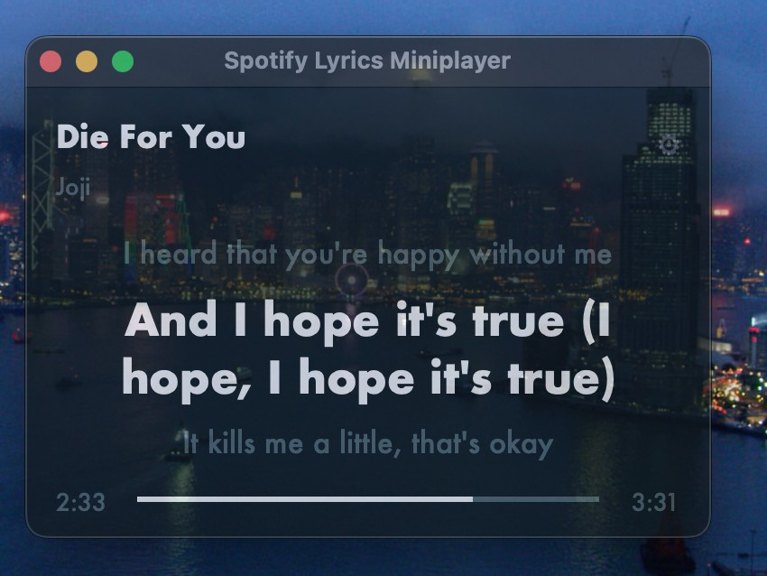

# Spotify Lyrics Miniplayer

A minimal macOS desktop overlay that shows time-synced lyrics for the currently playing Spotify track. The background colour is derived from the album art. No OAuth, no API keys — works out of the box.



## Requirements

Before you start, make sure you have all of the following:

| Requirement | Details |
|---|---|
| **macOS** | 10.14 or later |
| **Python 3.12** | Install via [Homebrew](https://brew.sh): `brew install python@3.12` |
| **Spotify desktop app** | [Download here](https://www.spotify.com/download/mac/) — the web player will not work |
| **Internet connection** | Needed to fetch lyrics on each new track |

## Features

- Always-on-top semi-transparent floating window
- Song title and artist display
- Time-synced lyrics — shows as many lines as fit the window size
- Background colour derived from the album art
- Progress bar with elapsed / total time
- **Adjustable transparency** via the ⚙ settings icon — drag the slider and hit Confirm (saved between sessions)
- Draggable — click anywhere and drag to reposition

## Option A — Double-click to run (recommended, no build needed)

```bash
git clone https://github.com/Adrenaline1560/spotify-lyrics-overlay.git
cd spotify-lyrics-overlay
```

Then double-click **`run.command`** in Finder.

On first launch it automatically sets up a virtual environment and installs dependencies. Subsequent launches start instantly.

> macOS will ask for **Automation** permission on first run so the app can talk to Spotify — click **OK**.
>
> If macOS blocks the script: right-click `run.command` → **Open** → **Open**.

## Option B — Build a native .app (double-clickable, no Terminal needed after)

```bash
git clone https://github.com/Adrenaline1560/spotify-lyrics-overlay.git
cd spotify-lyrics-overlay
python3.12 -m venv venv
source venv/bin/activate
pip install -r requirements.txt py2app
python3.12 setup.py py2app
cp -r "dist/Spotify Lyrics.app" /Applications/
```

Open **Spotify Lyrics** from your Applications folder or Spotlight like any other app.

> If macOS says it can't be opened: go to **System Settings → Privacy & Security** and click **Open Anyway**.

## Option C — Run directly from Terminal

```bash
git clone https://github.com/Adrenaline1560/spotify-lyrics-overlay.git
cd spotify-lyrics-overlay
python3.12 -m venv venv
source venv/bin/activate
pip install -r requirements.txt
python3.12 lyrics_overlay.py
```

## Adjusting transparency

Click the **⚙** icon in the top-right corner of the overlay to open Settings. Drag the slider to set how transparent the window is — lower means more see-through. Click **Confirm** to save, or **Cancel** to discard. Your setting is saved and will be restored every time you reopen the app.

## How it works

| Component | Technology |
|---|---|
| Reads Spotify track info | AppleScript via `osascript` (built-in to macOS) |
| Fetches lyrics | [lrclib.net](https://lrclib.net) REST API (free, no account) |
| Album colour | Pillow — averages album art pixels |
| UI | Python `tkinter` (stdlib) |

## Troubleshooting

| Symptom | Fix |
|---|---|
| "Open Spotify to get started" | Launch the Spotify desktop app (not the web player) |
| "No lyrics found" | Track may not be in lrclib's database |
| Lyrics slightly out of sync | Normal — position is polled every second |
| Window hides behind a full-screen app | Drag it back into view; known macOS/tkinter limitation |
| macOS blocks `run.command` | Right-click → Open → Open to bypass Gatekeeper |

## Privacy

- No data is sent to Spotify
- Track name and artist are sent to [lrclib.net](https://lrclib.net) solely to look up lyrics
